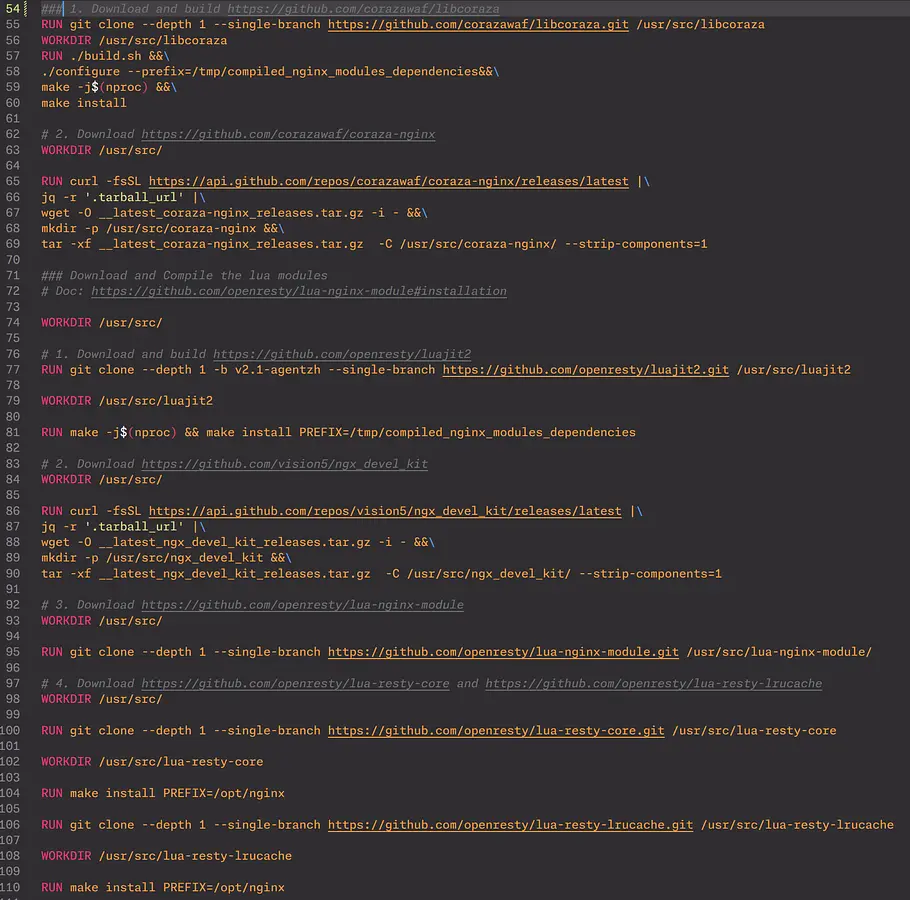

### Devlog #1 
Table of Devlogs:

- [Devlog \#1](https://stardance.hackclub.com/projects/24418/devlogs/12009) (This Devlog)
- [Devlog \#2](https://stardance.hackclub.com/projects/24418/devlogs/15733) 
- [Devlog \#3](https://github.com/lawrenceshi/ModsNGX/blob/main/Devlogs/3.md) (latest)
  - [Stardance shortened version](https://stardance.hackclub.com/projects/24418/devlogs/30289)
  - [GitHub Full version](https://github.com/lawrenceshi/ModsNGX/blob/main/Devlogs/3.md)

##### Hello!
I'm building a docker (or podman) image that can make deploying nginx easier.
The current version can compile and install the coraza-nginx, lua, and ngx_headers_more module as dynamic modules.
Hmm… It  seems  similar to openresty, but my version uses dynamic modules(aka “.so” files). It is closer to the original nginx, and it also simplifies the plugins that aren't used often. I also believe the image size will be smaller than openresty when I switch the base to alpine Linux.  Furthermore, I plan to include a default nginx configuration, not only a basic hello page, but basic ip rate limits, waf rules, and blocking secured files like “.env”, etc.

I started writing the Containerfile (almost the same as Dockerfile) when I was working on my website (not working). I quickly found out this could help someone, and I decided to make it a single project, so some git history may be missing.  Also, I am coding on the dev branch  for those who are confused.

TO-DOs:
*Outdated, please refer to the [latest](https://github.com/lawrenceshi/ModsNGX/blob/main/Devlogs/3.md) TO-DO list*
- Use the alpine Linux version as the basic image (I'm currently facing some issues with it)
- Write the default nginx.conf file
- Write the CI/CD file so it can be pushed to  docker hub automatically
- Support stable version (not always pull the latest nginx and everything)
- Prepare different versions that include different plugins
- Write a ReadMe
- Add a freenginx version