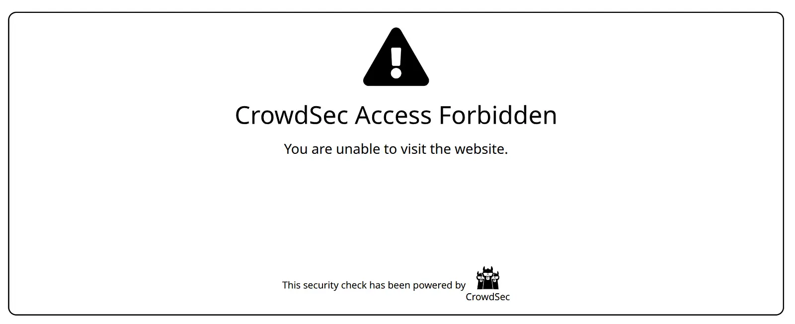

#  Devlog \#2

Table of Devlogs:

- [Devlog \#1](https://stardance.hackclub.com/projects/24418/devlogs/12009) 
- [Devlog \#2](https://stardance.hackclub.com/projects/24418/devlogs/15733) (This Devlog)
- [Devlog \#3](https://github.com/lawrenceshi/ModsNGX/blob/main/Devlogs/3.md) (latest)
  - [Stardance shortened version](https://stardance.hackclub.com/projects/24418/devlogs/30289)
  - [GitHub Full version](https://github.com/lawrenceshi/ModsNGX/blob/main/Devlogs/3.md)

Hello\!

I am working on a prepared docker (or podman) image with Nginx, lua and other plugins.

#### Changes:

The major change since the last devlog is that I added support for the crowdsec-nginx-bouncer. Furthermore, I standardized some comments, installing path, stage names. These changes don’t really affect building the image, but will make maintenance easier. 

#### Challenges:

I kept running into many kinds of errors. Mostly about missing or incorrect path to the dependency of the modules. The second most common errors are configuration problem or syntax issues.

#### Learned:

It might be surprising, but I feel like I learned how to use git the most. I didn’t use git a lot before, especially in a standard way.  
I learned the ` git add /path/to/file -p` method, so I could stage changes by chunks instead of files.

Also, I learned more about docker (or podman). I learned the dns resolver in docker is fixed as `127.0.0.11`, whereas it is dynamic in podman (can be shown by `podman network inspect \<network name\> | grep “gateway” `)

#### TO-DOs:

*Outdated, please refer to the [latest](https://github.com/lawrenceshi/ModsNGX/blob/main/Devlogs/3.md) TO-DO list*

I feel like I added a bunch of stuff and focused on those:  
- [ ] Add a version that is based on [alpine](https://hub.docker.com/_/alpine), [fedora](https://hub.docker.com/_/fedora), [debian-slim](https://hub.docker.com/_/debian?tag=stable-slim), and [Distroless](https://github.com/googlecontainertools/distroless) (Still struggling with alpine)  
- [ ] Shrink the size  
- [ ] Write the default nginx.conf file (I did the test one, but not the production one)  
- [ ] Write the CI/CD file so it can be pushed to docker hub automatically  
- [ ] Support stable version (not always pull the latest nginx and everything)  
- [ ]Prepare different versions that include different plugins  
- [ ]Write a README  
- [ ]Add a freenginx version  
- [ ]Prepare a non-dynamic module version (so it could be smaller)

#### Plan:

~~I plan to ship this before 2026-06-30T23:59-04:00 to earn the stickers~~ Nevermind. I spent my weekend cooking. Let's see how it goes.

P.S.: I also found a bug of the stardance shop system too. See more on GitHub: [https://github.com/hackclub/stardance/issues/700](https://github.com/hackclub/stardance/issues/700)   
