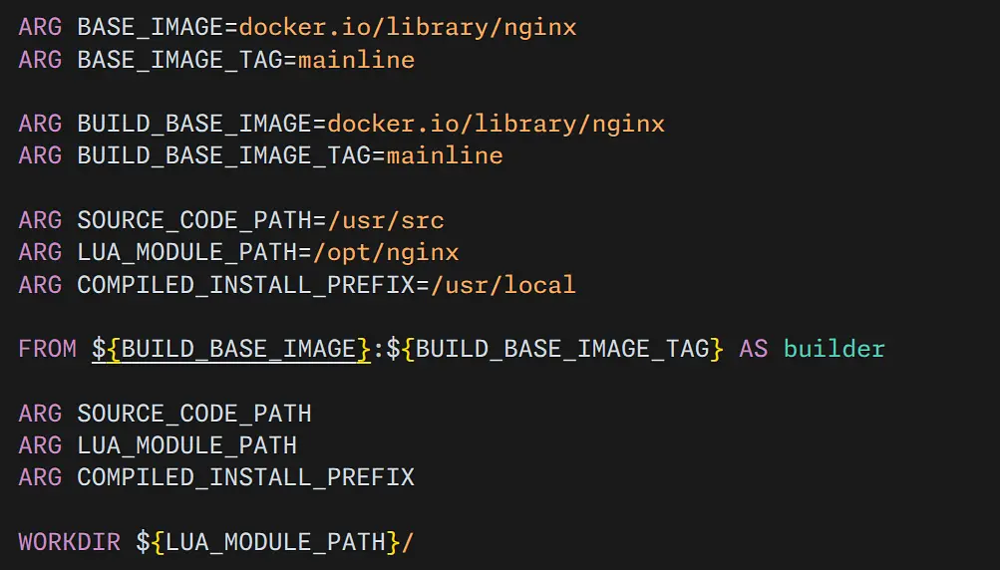

*I hit the Hack Club Stardance Devlog character limit, which was a little disappointing after writing so much. So I decided to post the full version of my devlog here!*

### Devlog \#3 
Table of Devlogs:

- [Devlog \#1](https://stardance.hackclub.com/projects/24418/devlogs/12009) 
- [Devlog \#2](https://stardance.hackclub.com/projects/24418/devlogs/15733)
- [Devlog \#3](https://github.com/lawrenceshi/ModsNGX/blob/Devlogs/Devlogs/3.md) (This Devlog)
  - [Stardance shortened version](https://stardance.hackclub.com/projects/24418/devlogs/30289)
  - [GitHub Full version](https://github.com/lawrenceshi/ModsNGX/blob/Devlogs/Devlogs/3.md)
- [Devlog \#4](https://stardance.hackclub.com/projects/24418/devlogs/33000) (latest) 

## Hi!
It has been a long time since I posted my last devlog, whether you count the days or the coding hours. I took a break surfing the internet and listening to the radio. After I came back, I ended up spending more than 10 hours coding. Anyway, there are some big changes.

If you missed the previous devlogs, I am making an OCI Image, basically a Docker image, that includes Nginx and a bunch of third-party modules and runs out of the box.

### Changes:
- I first tried to make a Containerfile generator. Just like most complicated C/C++ projects use ./configure to generate the Makefile, I planned to write a Python program that can generate the Containerfile for different combination of Nginx plugins. However, I think this may be too complicated for my project right now, so I moved the unfinished code to the experiment/containerfile-generator branch. I may come back to it later.
82 additions & 0 deletions
[#(WIP) Commit 2884ed1](https://github.com/lawrenceshi/ModsNGX/commit/2884ed16555dd837a4cf92a5f49455e0e0ae2038)

- Also, I did a big refactor with 134 additions and 89 deletions. Now the user can customize the versions of software and the installation path when building the image! I replaced a lot of fixed commands with build ARGs. The replacement tool really helped a lot! 
[#Commit c9a2643](https://github.com/lawrenceshi/ModsNGX/commit/c9a2643427797747784359ba27d6657cbd4815ef)

- I changed the project name from `slim-lua-nginx` to `ModsNGX`. Does it feel better? Old GitHub links should automatically redirect. If you run into any issue, try replacing the repository name in the link with `ModsNGX`, and feel free to contact me.

##### Some other small changes:
- chore: update .gitignore for VS Code 
14 additions & 0 deletions 
[#Commit 873307a](https://github.com/lawrenceshi/ModsNGX/commit/873307a793afff53a78d5de478a90d46ef5096de)
- chore: align test network with the legendary 10.10.10.10 
Because four tens are better than one.
*Personal opinion. 
(Yeah, this is literally the full commit) 
3 additions & 3 deletions 
[#Commit 6ba6545](https://github.com/lawrenceshi/ModsNGX/commit/6ba654507fb76b6abdcd08c368a99fb55388d2ac)
- fix: add missing space in Lua greeting message
1 addition & 1 deletion
[#Commit e5ca246](https://github.com/lawrenceshi/ModsNGX/commit/e5ca2466c9b7473a1fd6b578dabd2e1231b5b45e)
- chore: make debian the default test image 
3 additions & 3 deletions 
[#Commit 0d1c36c](https://github.com/lawrenceshi/ModsNGX/commit/0d1c36c5d7f8e810cec7ce1640ee159760492eb3)
- docs: add safety warning for test API key
1 addition & 0 deletions
[#Commit 1cd70ee](https://github.com/lawrenceshi/ModsNGX/commit/1cd70eed2e985c1598456c0a04142b62bda9adac)

It is kinda weird, but I committed my latest changes first, and then commit my early generator code. It's somehow out of order. Some code I commit now is written two weeks ago.

### Challenges:
I want to make everything customizable, but I also don't want the arguments to become overwhelming. At the same time, I want to make it simple to maintain and develop.
I also messed up and made some mistakes when replacing the fixed paths with `ARG`. I really shouldn't smash them all in one commit.

### Learned:
I used a lot of `ARGs`. 

Roughly, I learned:
- `ARG` is only available during the build stage, while `ENV` is kept in the final image.
- `ARG` can be passed with `docker build --build-arg MY_ARG=my_value`. Podman uses the same format.
- `ARG` can be used in a `FROM` command must be declared before the **first** `FROM` command, even when there are multiply `FROM` in the file.
- When using an ARG in multiple stages, it should be declared before the **first** `FROM`, and then declared again in the  required stages.

## E.g.
In this example, `ONE_ARG` can be used in both stages, `TWO_ARG` can only be used in the `first` stage and `THREE_ARG` can only be used in the `second` stage. As mentioned in the comment, we must declare the `SECOND_IMAGE` and `SECOND_TAG` `ARG` before the first `FROM` because we used them in a `FROM` command.

```Dockerfile
# Global ARG
ARG ONE_ARG=1

# Full image name is library/hello-world, "library" is omitted
ARG FIRST_IMAGE=hello-world
ARG FIRST_TAG=latest

# This must be put before the first FROM, or it won't work.
ARG SECOND_IMAGE=docker/getting-started-app
ARG SECOND_TAG=latest


FROM ${FIRST_IMAGE}:${FIRST_TAG} AS first

ARG ONE_ARG
ARG TWO_ARG=2

RUN echo ${ONE_ARG}

RUN echo ${TWO_ARG}

FROM ${SECOND_IMAGE}:${SECOND_TAG} AS second

ARG ONE_ARG
ARG THREE_ARG=3

RUN echo ${ONE_ARG}

RUN echo ${THREE_ARG}
```

#### TO-DOs:

I made some changes of the plan to reduce repetitive work, and to stick to the official Nginx Docker Image.

*Outdated, please refer to the [latest](https://stardance.hackclub.com/projects/24418/devlogs/33000) TO-DO list*
  
- [ ] Add an Alpine-based version. I am still struggling with Alpine, mainly because of CGO.
- [ ] Shrink the size  
- [ ] Write the default nginx.conf file (I did the test one, but not the production one)  
- [ ] Write CI/CD so it can be pushed to Docker Hub, GitHub Container Registry, etc. automatically.
- [50%] Support stable and fixed versions (fixed versions work, but the Nginx stable line is not supported yet)
- [ ] Prepare different versions that include different plugins  
- [ ] Verify the sha512 of the files I download.
- [ ] Write a README  
- [ ] Make a general .sh build script so I do not have to maintain two Containerfiles.
- [ ] Change the GitHub repo name.
- [ ] Read the Nginx official Dockerfile for reference.

#### Plan:

Ship it when I feel it is ready!!

*I regret making the gap between the two devlogs this long. It literally took me an hour to separate the mixed code and stage the changes, and I also spent almost my whole day on this devlog. Even worse, I hit the 4000-character limit.*