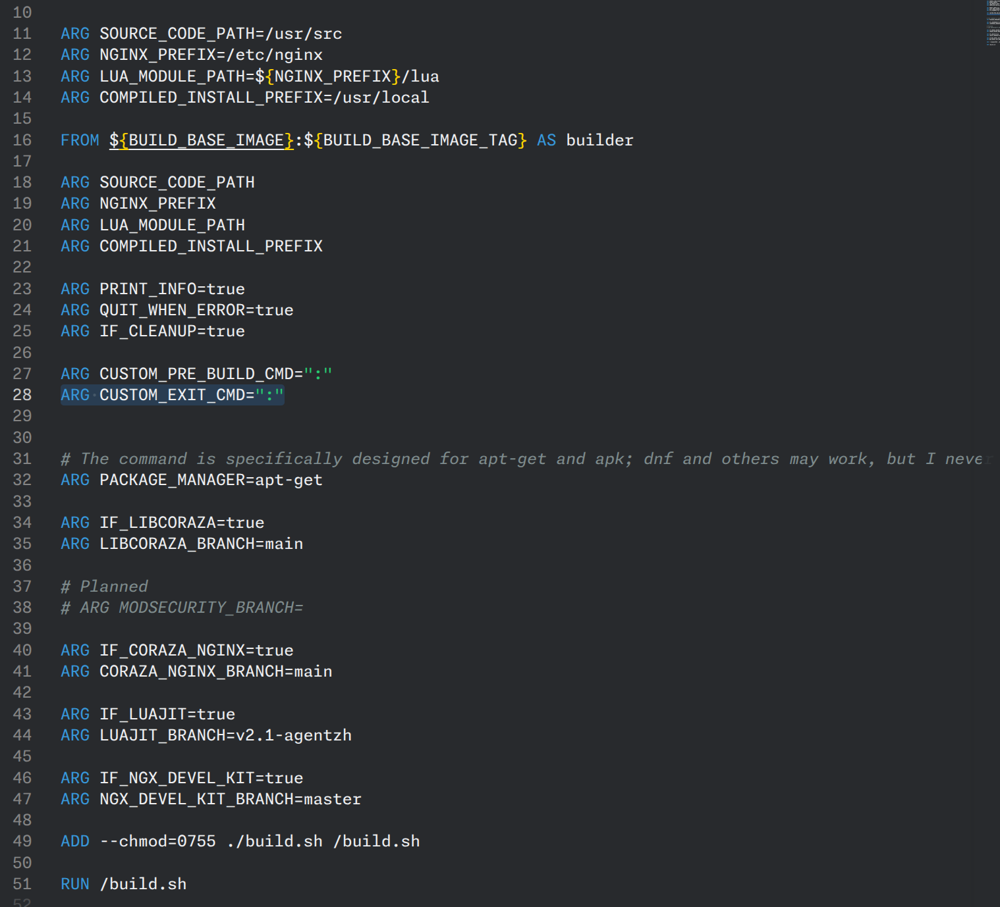

# Devlog \#4

Table of Devlogs:

- [Devlog \#1](https://stardance.hackclub.com/projects/24418/devlogs/12009) 
- [Devlog \#2](https://stardance.hackclub.com/projects/24418/devlogs/15733)
- [Devlog \#3](https://github.com/lawrenceshi/ModsNGX/blob/Devlogs/Devlogs/3.md)
  - [Stardance shortened version](https://stardance.hackclub.com/projects/24418/devlogs/30289)
  - [GitHub Full version](https://github.com/lawrenceshi/ModsNGX/blob/Devlogs/Devlogs/3.md)
- [Devlog \#4](https://stardance.hackclub.com/projects/24418/devlogs/33000) (latest) (This Devlog)

# Hello!

I am now working on a big refactor (again).

I am planning to write a .sh script that can be used in either alpine or debian based image.

*A rough description of what I am making from my previous Devlog:*
I am making an OCI Image, basically a Docker image, that includes Nginx and a bunch of third-party modules and runs out of the box.

## Leanred

I was almost new to `.sh` scripts. I knew it is similar to the command used in Terminal, but I didn't know there are actually some huge difference.

- ##### `case` and `if `
  - I learned how to use the `case` command.
  - I learned more about the `if` command.
  - A quick example:
    ```sh
    # /bin/sh
    
    # Example for Case
    case ${YOUR_ENV} in 
    "Apple")
    echo "The ENV is Apple"
    # Ending symble
    ;;
    "Orange"|"Banana")
    echo "The ENV is either Orange or Banana"
    ;;
    # Ending symble
    esac

    # Example for if:

    # Conditions can be:

    [ -z ${YOUR_ENV} ] # If the ENV is empty
    [ ${YOUR_ENV} == "Hi" ] # If the ENV matches the string Hi

    # The space after the "[" and before the "]" is super important. It cannot be forgotten. 

    # Read more about the space:
    # https://www.shellcheck.net/wiki/SC1020

    if [ condition ]; then
         echo "The condition is True!"
    else
        echo "The condition is not True!"

    # Ending symble
    fi
    ```

#### TO-DOs:

*Please always refer to the TO-DO list in the latest devlog.*

- [ ] Add an Alpine-based version. I am still struggling with Alpine, mainly because of CGO.
- [ ] Shrink the size  
- [ ] Write the default nginx.conf file (I did the test one, but not the production one)  
- [ ] Write CI/CD so it can be pushed to Docker Hub, GitHub Container Registry, etc. automatically.
- [50%] Support stable and fixed versions (fixed versions work, but the Nginx stable line is not supported yet)
- [ ] Prepare different versions that include different plugins  
- [ ] Verify the sha512 of the files I download.
- [ ] Write a README  
- [ WIP ] Make a general .sh build script so I do not have to maintain two Containerfiles.
- [ ] Change the GitHub repo name.
- [ ] Read the Nginx official Dockerfile for reference.
- [ ] Add healthcheck

More information will be provided in the next Devlog (Devlog \#5 ).